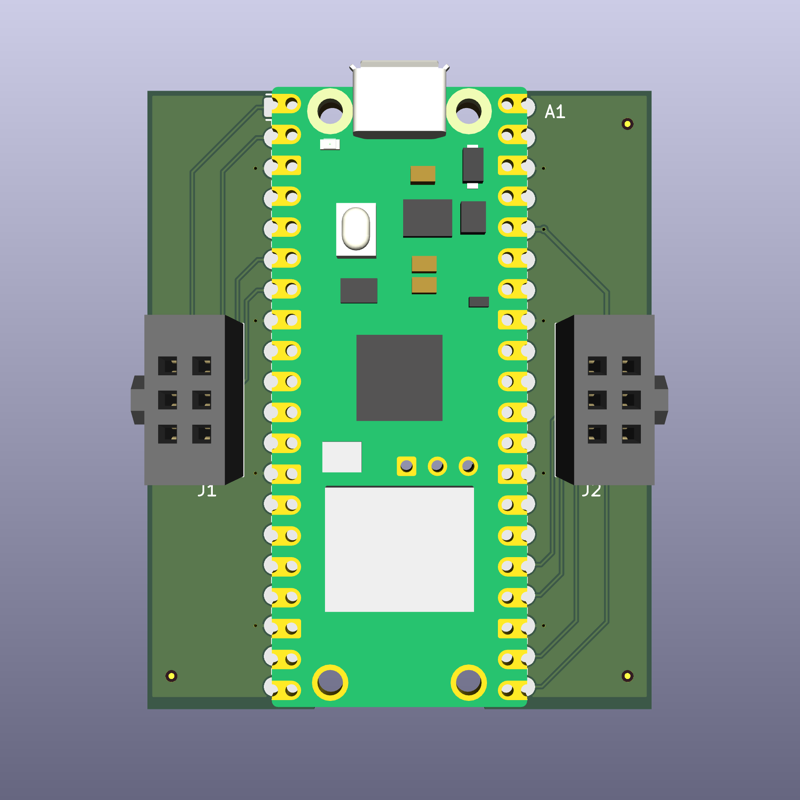
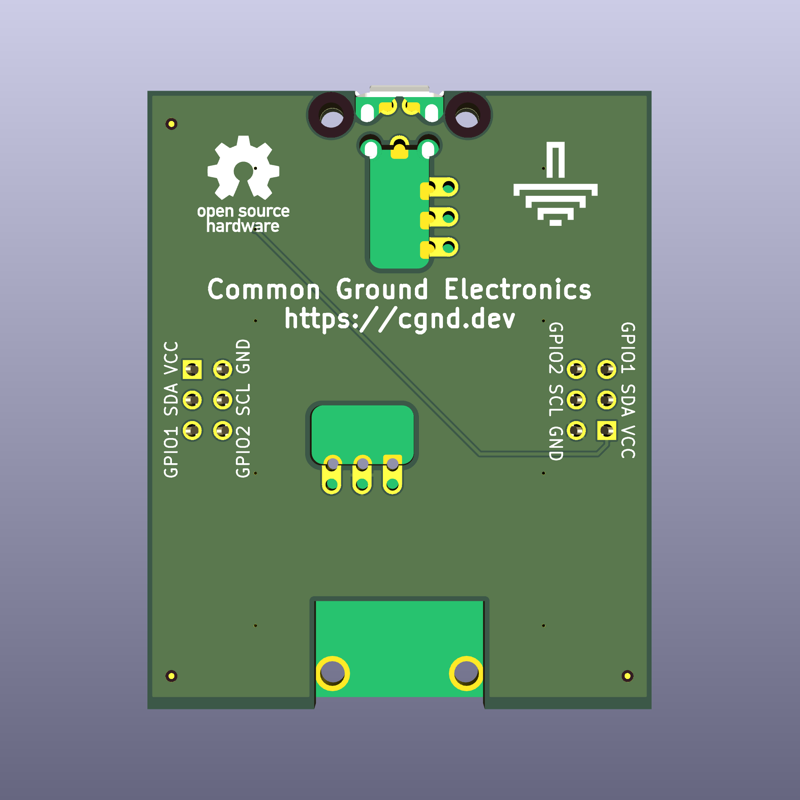

# Raspberry Pi Pico SAO Host

The Raspberry Pi Pico SAO Host is a breakout board that adds [Simple Add-on (SAO)](https://hackaday.io/project/175182-simple-add-ons-sao) host connectors to the [Raspberry Pi Pico](https://www.raspberrypi.com/products/raspberry-pi-pico/).

## Version 1

The `v1` design is an example of a stand-alone KiCad project. It exclusively uses project-local libraries in this repository and does not depend on the global library bundled with KiCad.

> [!WARNING]
> The `v1` design is **NOT** actually compatible with the RaspberryPi Pico W (wireless) variants due to a mistake in the footprint. See [this issue](https://github.com/cgnd/rpi-pico-sao-host/issues/3) for more details.

## License

See the [LICENSE](LICENSE.md) file for copyright & license information.
