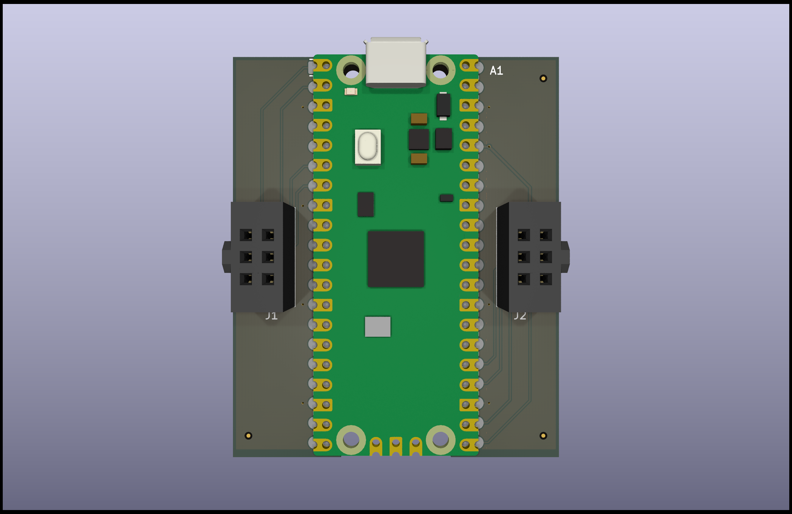
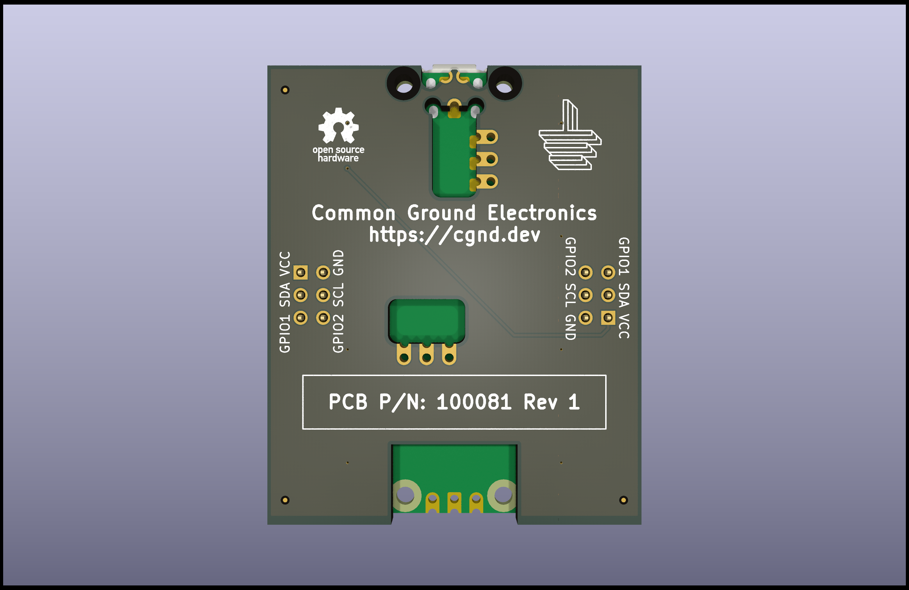

# RPi Pico SAO Host v1

The RPi Pico SAO Host v1 is a breakout board that adds two [Simple Add-ons (SAO)](https://hackaday.io/project/175182-simple-add-ons-sao) host connectors to the [RaspberryPi Pico](https://www.raspberrypi.com/products/raspberry-pi-pico/).

> [!WARNING]
> The Rev 1 PCB is **NOT** compatible with the RaspberryPi Pico W (wireless) variants. See [this issue](https://github.com/cgnd/rpi-pico-sao-host/issues/3) for more details.

