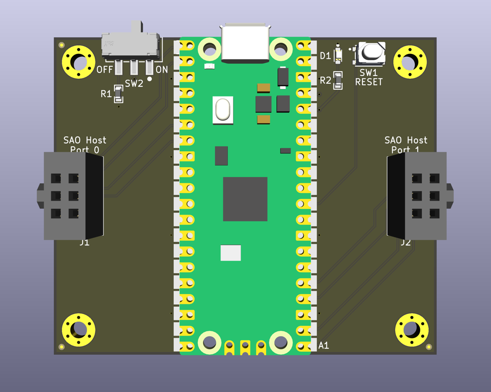
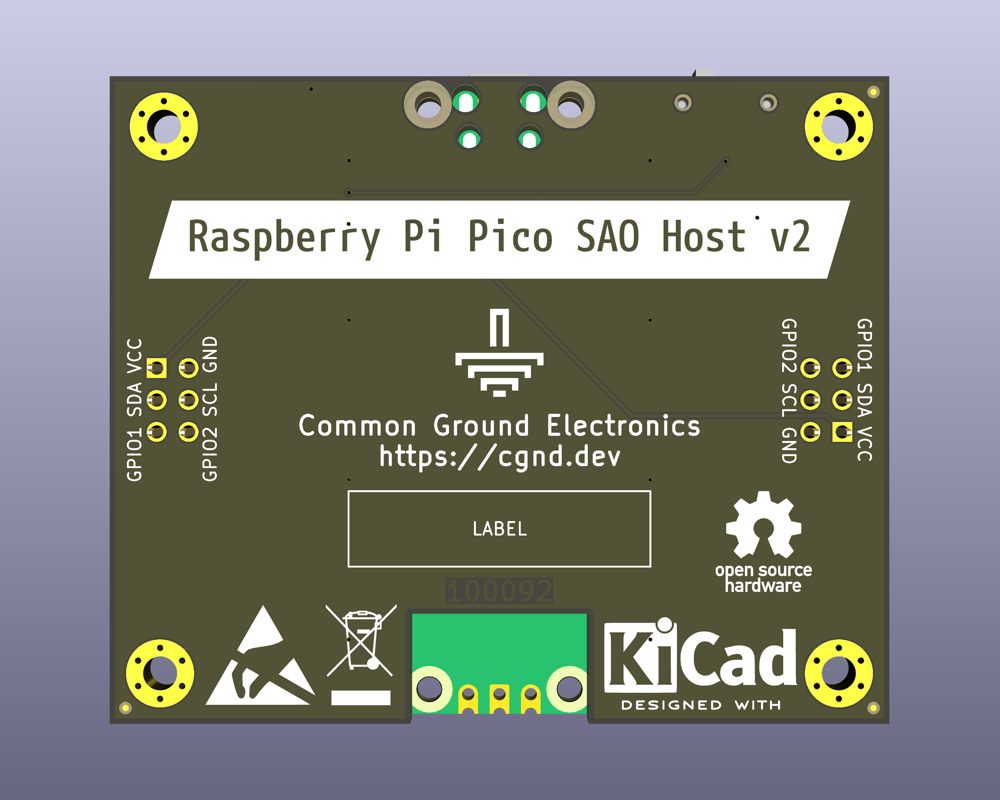

# Raspberry Pi Pico SAO Host

The [Raspberry Pi Pico SAO Host](https://github.com/cgnd/rpi-pico-sao-host) is a breakout board that adds [Simple Add-on (SAO)](https://hackaday.io/project/175182-simple-add-ons-sao) host connectors to the [Raspberry Pi Pico](https://www.raspberrypi.com/products/raspberry-pi-pico/).

## v2 Design (latest)

The `v2` design adds the following features:

* A power switch (`SW2`) attached to the the Pico's `3V3_EN` input pin.
* A power LED (`D1`) that turns on when the Pico is powered on.
* A tactile reset switch (`SW1`) connected to the Pico's `RUN` input pin.

See the [CHANGELOG](CHANGELOG.md) for a full list of the changes from the previous version.

**Top (Primary) Side**



**Bottom (Secondary) Side**



### Checking out the design

To check out the design, [download the zip](https://github.com/cgnd/rpi-pico-sao-host/archive/refs/heads/v2.zip) or clone the repository using Git.

```sh
git clone https://github.com/cgnd/rpi-pico-sao-host.git
```

Open the the [RPi_Pico_SAO_Host.kicad_pro](RPi_Pico_SAO_Host.kicad_pro) project file in KiCad (requires version 9 or later).

## v1 Design

See the [README](https://github.com/cgnd/rpi-pico-sao-host/blob/v1/README.md) on the [v1](https://github.com/cgnd/rpi-pico-sao-host/tree/v1) branch for information about the `v1` design.

## License

See the [LICENSE](LICENSE.md) file for copyright & license information.
